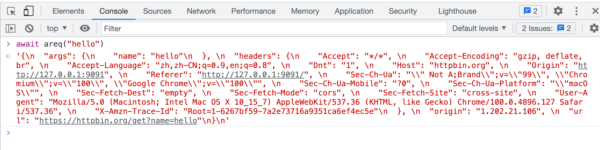

# Go_wasm_demo
使用 Go 开发 WebAssembly 代码示例，Go1.18


feature:

- makefile 自动构建
- brotli 压缩
- 异步回调


# 启动

```
git clone https://github.com/zzzzls/Go_wasm_demo.git
cd Go_wasm_demo

make
```


- `make run`: 启动
- `make status`: 查看状态
- `make stop`: 停止


# js 调用

```
await areq("hello")
```





# 参考文档

- Go WebAssembly (Wasm) 简明教程

  https://geektutu.com/post/quick-go-wasm.html

- Go-WebAssembly

  https://github.com/golang/go/wiki/WebAssembly#webassembly

- syscall/js

  https://pkg.go.dev/syscall/js